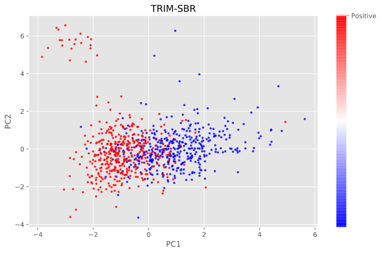

# TRIM-SBR: TRIM-Smoothed Bootstrap Resampling

[](https://travis-ci.com/python/mypy)

TRIM-Smoothed Bootstrap Resampling (TRIM-SBR) is a proposed method to reduce the overgeneralization problem that usually occurs when synthetic data is formed into a majority class region with evenly distributed synthetic data effects. Our method is based on pruning by looking for a particular minority area while maintaining the generality of the data so that it will find the minority data set while filtering out irrelevant data. The pruning results will produce a minority data seed that is used as a benchmark in duplicating data. To ensure the duplication of data is evenly distributed, the bootstrap resampling technique is used to create new data.

# Installation

The implementation is tested under python 3.7

* numpy (numpy>=1.13, <1.17)
* scikit-learn (>=0.19.0, <0.23)

## Clone the repo:

Clone this repository and run the TRIM-SBR.py file. Use the following commands to get a copy from GitHub and install all dependencies:

```
git clone https://github.com/praswibowo/TRIM-SBR.git
```

# Documentation

This project follows the [imbalanced-learn](https://imbalanced-learn.org/) and [smote-variants](https://smote-variants.readthedocs.io/), the both of the documentation might also prove helpful.

## Example Usage
```
TRIM_sbr = MulticlassOversampling(TRIM_SBR(random_state=42))
TRIM_sbr_X_train, TRIM_sbr_y_train = TRIM_sbr.sample(X_train, y_train)

np.bincount(TRIM_sbr_y_train)
```
### Expected Output:

```
##TRIM SBR
2021-06-09 12:02:16,637:INFO:MulticlassOversampling: Running multiclass oversampling with strategy eq_1_vs_many_successive
2021-06-09 12:02:16,640:INFO:MulticlassOversampling: Sampling minority class with label: 1
2021-06-09 12:02:16,643:INFO:TRIM_SBR: Running sampling via ('TRIM_SBR', "{'proportion': 1.0, 'min_precision': 0.3, 'random_state': 42}")
2021-06-09 12:02:16,644:INFO:TRIM_SBR: do the trimming process

array([415, 415], dtype=int64)
```
### Before Oversampling:


### After Oversampling:


# Citation

If you use k-means SMOTE in a scientific publication, we would appreciate citations to the following [paper](https://github.com/praswibowo):

```
@article{Wibowo2021,
author = {Wibowo, Prasetyo and Fatichah, Chastine},
doi = {10.26594/register.v7i1.2206},
issn = {25023357},
journal = {Register: Jurnal Ilmiah Teknologi Sistem Informasi},
keywords = {Classification,Imbalanced dataset,Oversampling,Performance analysis},
number = {1},
pages = {63--71},
title = {{An in-depth performance analysis of the oversampling techniques for high-class imbalanced dataset}},
volume = {7},
year = {2021}
}

```

# Reference

[1] K. Puntumapon, T. Rakthamamon, and K. Waiyamai, “Cluster-based minority over-sampling for imbalanced datasets,” IEICE Trans. Inf. Syst., vol. E99D, no. 12, pp. 3101–3109, 2016, doi: 10.1587/transinf.2016EDP7130.

[2] G. Menardi and N. Torelli, Training and assessing classification rules with imbalanced data, vol. 28, no. 1. 2014.
